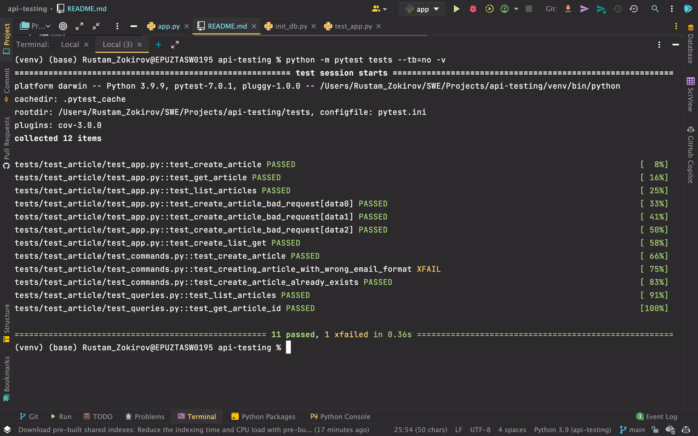
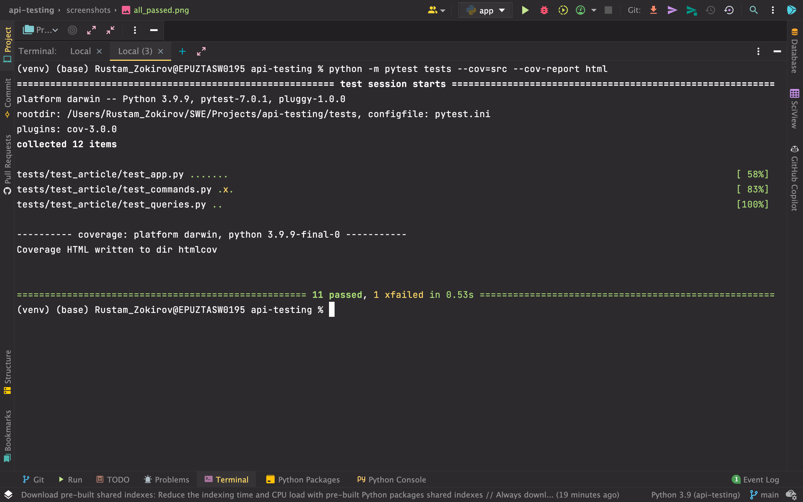
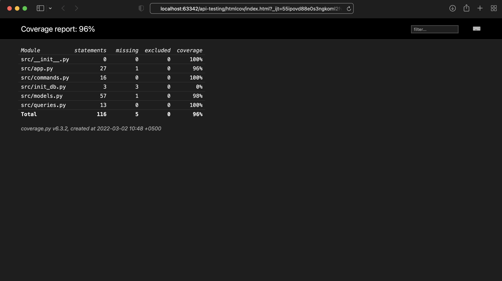

# API Testing for blog app

### Libraries used
- `pytest` - library to write tests with powerful fixtures and parametrization features
- `pydantic` - runtime data validation (similar to @dataclass)
- `Flask` - to create RESTful API 
- `sqlite3` - database

### Objectives
- Configure pytest and project structure
- Define database models with pydantic
- Use pytest fixtures for managing test state and performing side effects 
- **Verify JSON responses against JSON Schema definitions**
- Organize database operations with commands (modify state, has side effects) and queries (read-only, no side effects)

### Test plan
- Write unit, integration, and end-to-end tests with pytest 
- Generate a coverage report
- Create a test framework:
  - `commands.py`, CreateArticleCommand
  - `queries.py`, ListArticlesQuery, GetArticleByIDQuery, GetArticleByTitleQuery

### Test scenarios and test cases
1. Create article 
   1. TC1: Create article -> Expected: all data fields match 
   2. NTC2: Create article with wrong email format (without @) -> Expected: FAIL
   3. NTC3: Create article with wrong title format -> Expected: FAIL
   4. NTC4: Create article which already exists -> Expected: AlreadyExists Exception
2. Articles can be fetched (select by ID or Title)
   2. TC5: Add an article to DB, then query select by ID
   3. NTC6: Get article by ID which doesn't exist, empty ID field, int data type -> Expected: models.NotFound
   4. NTC7: Get article by title which doesn't exist, same as NTC7
3. Articles can be listed (select all)
   1. TC8: Add articles then list articles
4. E2E PI test 
    - Create a new article
    - List articles
    - Get the first article from the list
  
### API endpoints documentation
- `/create-article/` - creates a new article
- `/articles/` - retrieve all articles
- `/article/<article_id>/` - fetch a single article, `article_id` is string type

### How to run?
- `python -m pytest -v --tb=no tests/`
- To run E2E test use `python src/init_db.py` and `FLASK_APP=src/app.py python -m flask run`
    - If you got a problem use `export PYTHONPATH=$PYTHONPATH:$PWD`
    - And, `python -m pytest tests -m 'e2e'`

- `python -m pytest tests --cov=src --cov-report html`

## Read more here
- Acknowledgment to the author of [this](https://testdriven.io/blog/modern-tdd/) article! 
- [How to set up env. vars in Python](https://able.bio/rhett/how-to-set-and-get-environment-variables-in-python--274rgt5)
- [More Pytest plugins](https://towardsdatascience.com/pytest-plugins-to-love-%EF%B8%8F-9c71635fbe22)

## TODO
- [ ] Add a hook to treat `XFAIL` as `PASS`
- [ ] Add Jenkins CI pipeline with GitHub Webhook
- [ ] Refactor `models.py`, with SQL queries in different file
- [ ] Set up logging
- [ ] Extend functionality of framework and add more E2E tests
